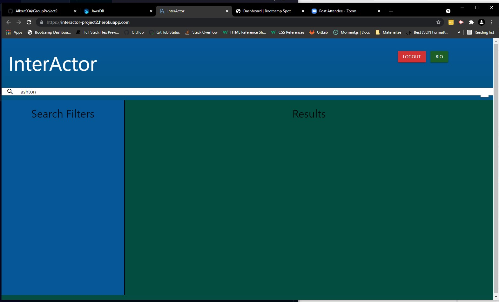

# InterActor - (GroupProject 2)

# This is the submission for Group Project #2 [InterActor] (https://github.com/Allout004/GroupProject2) for U/W Coding Bootcamp Full Stack Flex Program, for Kurt Heimerman.

## Notes About Application:      
* Looks for 2 or more actors/actresses in the same movie
* Added login functionality along with teh ability to start writing and saving bios

## The deployed app is here:  https://interactor-project2.herokuapp.com/

## It uses HTML, CSS, Materialize, Web-API fetch, Javascript, Jquery and TMDB API, Exspress, Node.js, SQL, Handlebars, sequlize, jawsDB.

